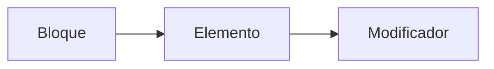
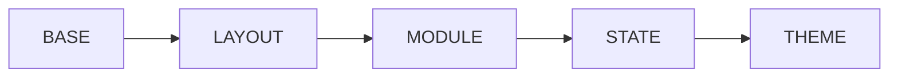

# CURSO DE FRONTEND DEVELOPER

### ¿Qué es HTML y CSS?

#### HTML

Lenguaje de marcado de hipertexto.

> "Es el esqueleto de una página web."

#### CSS

Hojas de estilo en cascada.

> "Es el lenguaje que le da vida al esqueleto."

## HTML

### MOTORES DE RENDERIZADO

Pasar de archivos a pixeles en pantalla.

| Navegador | Second Header |
| --------- | ------------- |
| Chrome    | Blink         |
| Edge      | Edge HTML     |
| Safarí    | Webkit        |
| Firefox   | Gecko         |

#### Pasos del navegador

1. Pasa los archivos a objetos
2. Calcula el estilo correspondiente a cada Nodo Dom
3. Calcula las dimensiones de cada nodo y dónde va en la pantalla
4. Pinta las diferencias
5. Toma las capas y las convierte en una imagen para mostrar en pantalla

### ANATOMÍA DE UN DOCUMENTO HTML Y SUS ELEMENTOS

```seq
    ELEMENTO
    <h1> Soy un título </h1>
     |          |          |
Etiqueta    Contenido   Etiqueta
de apertura             de cierre

    ATRIBUTO
    <>Etiqueta de apertura<>
    <h1 class = "title">
          |         |
       atributo   valor
```

#### Anidamiento

```html
<section>
  <h1>Soy un título</h1>
  <p>Soy un texto</p>
  <ul>
    <li>Elemento 1</li>
    <li>Elemento 2</li>
    <li>Elemento 3</li>
  </ul>
</section>
```

#### Elementos vacíos

Son quellos que no tienen etiqueta de cierre.

```html

```

#### Estructura básica de un archivo .html

```html
    <!Doctype html>//<----
    <html lang="en">//<----
        <head>//<----
            <meta name="utf-8">
            ...
            <title>Ejemplo de página</title>
        </head>
        <body>//<----

            <header>...
            <nav>...
            <section>...
            <footer>...

        </body>
    </html>
```

### HTML SEMÁNTICO

> Blockquotes "Evitar el uso inecesario de <div>"

Etíquetas con significado

1. Ayuda al sitio a ser "accesible"
2. Mejora posicionamiento SEO
3. Código más claro

#### <div> Más utilizados y comunes

##### Layout

```html
<header>
  <nav>
    <section>
      <article>
        <aside>
          <footer></footer>
        </aside>
      </article>
    </section>
  </nav>
</header>
```

##### Enlaces

```html
<a></a>
```

##### Textos

```html
<h1>
  ...
  <h6>
    <p>
      <span></span>
    </p>
  </h6>
</h1>
```

##### Imágenes y video

```html

<svg>
  <iframe>
    <video></video>
  </iframe>
</svg>
```

##### Formularios

```html
<form>
  <input />
  <label> <button></button></label>
</form>
```

##### Listas

```html
<ul>
  <li>
    <ol></ol>
  </li>
</ul>
```

Más referencias HTML: <https://htmlreference.io/>

## CSS

### ANATOMÍA DE UNA DECLARACIÓN CSS

Estructura básica

```html
<style>
  h1 /* selector */ {
    /* propiedad : valor*/
    color: pink;
  }
</style>
```

### TIPO DE SELECTORES

| Selector  | Referencia       |
| --------- | ---------------- |
| Tipo      | div{...}         |
| Clase     | .elemento{...}   |
| ID        | #id-del-elemento |
| Atributo  | a[href:""]{...}  |
| Universal | \*{...}          |

#### Selectores combinados

|                     |         |
| ------------------- | ------- |
| Descendientes       | div p   |
| Hijo directo        | div > p |
| Elemento adyacente  | div + p |
| General de hermanos | div ~ p |

### Pseudoclases y pseudoelementos

> También podemos ver a las pseudoclases como estados de algún elemento (con el mouse encima, visitado, activo, etc.) y a los pseudoelementos como elementos que escribimos desde CSS, por ejemplo, el ::after y el ::before nos puedes funcionar como divs, como su nombre lo dice, son elementos, pero no necesariamente están escritos desde el HTML 👀.

Ejemplos:

| Pseudoclases  | Pseudoelementos |
| ------------- | --------------- |
| :active       | ::after         |
| :focus        | ::before        |
| :hover        | ::first-letter  |
| :nth-child(n) | ::placeholder   |

Referencias:  
[Links]https://developer.mozilla.org/en-US/docs/Web/CSS/Pseudo-elements
[Links]https://css-tricks.com/pseudo-class-selectors/

### TIPOS DE DISPLAY MÁS UTILIZADOS

Display:

Es el tipo de visualización que tienen los elementos.

-> inline: Estos elementos son los que su caja mide exactamente lo mismo que su contenido. Estos elementos los podemos usar en textos y en lugar de que se agreguen en una nueva línea se agregaran justo al ladito del texto. ❗ Tienen como desventaja que no podemos ponerles márgenes ni tampoco podemos cambiar su tamaño.

-> block: Estos elementos ocupan toda la pantalla, por lo que si quieres agregar otro elemento, este se agregará automáticamente abajo. No importa que tengas poco contenido, el elemento sí o sí va a ocupar toda la pantalla.

-> inline-block: Esto mezcla lo mejor de ambos mundos. Con este display podemos tener tanto los beneficios de inline como de block, es decir, podemos tener elementos que no ocupen todo el ancho de la pantalla, sino que ocupen solamente lo que su contenido ocupa, pero también vamos a poder darle márgenes y podremos cambiar su tamaño 🤠.

Grid y flexbox

La diferencia básica entre CSS Grid Layout y CSS Flexbox Layout es que Flexbox se creó para diseños de una dimensión, en una fila o una columna. En cambio CSS Grid Layout se pensó para el diseño bidimensional, en varias filas y columnas al mismo tiempo

[Links with title](https://developer.mozilla.org/es/docs/Web/CSS/CSS_Grid_Layout/Relationship_of_Grid_Layout "Más información Developer Mozilla")

#### Flex

La propiedad CSS flex es una propiedad resumida que indica la capacidad de un elemento flexible para alterar sus dimensiones y llenar el espacio disponible. Los elementos flexibles pueden ser estirados para utilizar el espacio disponible proporcional a su factor de crecimiento flexible o su factor de contracción flexible para evitar desbordamiento.
 https://developer.mozilla.org/es/docs/Web/CSS/flex

Juego para practicar flexbox
https://flexboxfroggy.com/#es

### MODELO DE CAJA


#### Colapso de márgenes

Sucede cuando:
Hay dos elementos bloque adyacentes
```html
  <p>sol</p>
  <p>luna</p>
```

No sucede cuando:
Flexbox, Grid y elementos que no sea bloque.
```html
  <div> /*display:flex*/
    <p>mar</p>
    <p>aire</p>
  </div>
```
### POSICIONAMIENTO

Nos ayuda a ubicar los elementos.

- Relative
- Absolute
- Fixed
- Sticky
- Static
- Initial
- Inherital

#### Z-INDEX y el contexto de apilamiento


### PROPIEDADES Y VALORES DE CSS MÁS USADOS 

+ Layout
  + display

+ Textos
  + font-size
  + font-weight
  + font-family
  + text-align
  + color

+ Modelo de caja
  + margin
  + padding
  + border

+ Tamaños
  + width
  + height

+ Colores de fondo
  + background
  + background-color

[CSS REFERENCIAS](https://cssreference.io/)

### UNIDADES DE MEDIDA

| Absolutas     | 
| ------------- | 
| px            | 
| pc            | 
| cm            | 
| pt            |
| in            |
| mm            | 

| Relativos | 
| ----------| 
| rem       | 
| em        | 
| vw        | 
| vh        |
| vmin      | 
| vmax      |
| ex        |  
| ch        |

### DISEÑO RESPONSIVO

Que el sitio se vea bien en varias medidas de pantalla.

#### Media queries
```html
  @media(max-width:375px){
    .clase-que-cambiar-por-tamano{
      propiedad:valor
    }
  }
```
### ¿Qué son las arquitecturas CSS? ¿Para qué sirven?

Objetivos 
+ Ser predecible
  Escribir reglas claras.

+ Reutilizable
  No escribir código redundante.

+ Mantenible
  Que sea fácil de leer y adaptable a los estándares.

+ Escalable
  Que pueda crecer sin afectar el rendimiento

Buenas prácticas
+ Lineamientos
+ Documentación
+ Estándares
+ Componentes

### OOCSS, BEM, SMACSS, ITCSS Y ATOMIC DESIGN

#### OOCSS
  <table>
    <thead>
    <tr>
      <th colspan="2">Principales</th>
    </thead>
      <tbody>
        <tr>
          <td>  Separar la estructura y la piel: OBJETO ----> MÁSCARA </td>
          <td>  Separar el contenedor del contenido </td>
        </tr>
      </tbody>    
    </table>

#### BEM

#### SMACSS



[OOCSS](https://www.smashingmagazine.com/2011/12/an-introduction-to-object-oriented-css-oocss/#top)

[BEM](https://en.bem.info/methodology/)

[SMACSS](https://medium.com/@GreenXIII/organize-your-css-smacss-way-89c087db5092)

[ITCS](https://www.xfive.co/blog/itcss-scalable-maintainable-css-architecture/)

[ATOMICDESIGN](https://bradfrost.com/blog/post/atomic-web-design/) 


